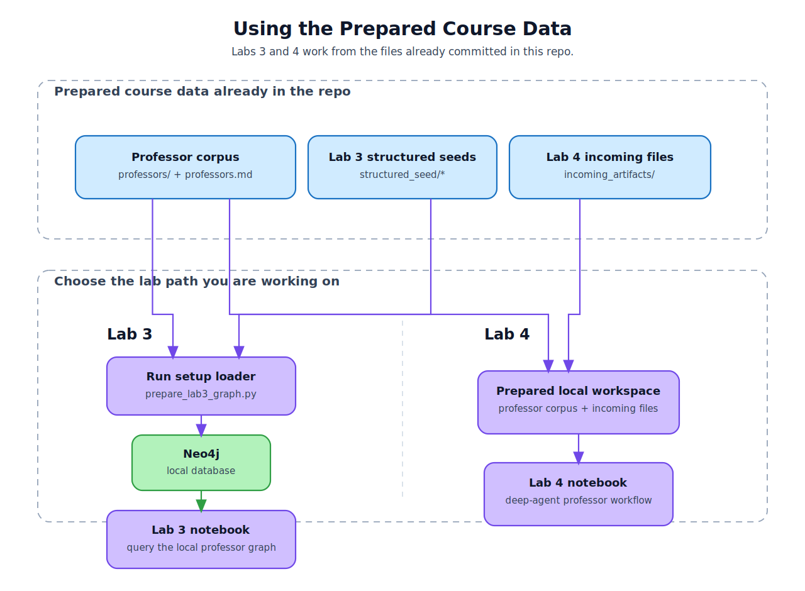

# multi_agents_hands_on

Hands-on teaching materials for building multi-agent systems with LangChain and LangGraph.



This README is written for students working through the labs. The professor dataset you need for Labs 2, 3, and 4 is already committed in the repo, so your main job is to set up the environment and load the right local data for each lab. For Lab 3, the committed structured professor JSON files can be inserted directly into the Neo4j instance running in Docker. No crawl, OCR pass, or LLM call is required for that student flow.

## Start Here

1. Copy the example environment file:

```bash
cp .env.example .env
```

2. Install the project environment.

Recommended: use `uv`, which will create and sync the repo-local `.venv` for you:

```bash
uv sync
```

If you do not have `uv`, use one of these short fallbacks:

Plain Python 3.11:

```bash
python3.11 -m venv .venv
source .venv/bin/activate
python -m pip install -U pip
pip install -e .
```

Miniconda:

```bash
conda create -n agents-tutorial python=3.11 -y
conda activate agents-tutorial
pip install -U pip
pip install -e .
```

3. Open the repo in VS Code and select the notebook kernel from the environment you just created:

- `./.venv/bin/python` for the `uv` or plain-venv path
- the `agents-tutorial` interpreter for the conda path

4. Launch Jupyter when you are ready to work through the notebooks:

```bash
uv run jupyter lab
```

5. Start Neo4j if you are doing Lab 1 or Lab 3:

```bash
docker compose up -d neo4j
```

## How Each Lab Uses Data

### Lab 2

Lab 2 works from the committed professor markdown corpus:

- `lab_4_deep_agents/professors/`
- `lab_4_deep_agents/professors.md`

### Lab 3

Lab 3 uses a local Neo4j database. Before opening the notebook, load Neo4j from the committed typed structured profile files:

```bash
docker compose up -d neo4j
uv run python lab_3_langgraph_swarm/prepare_lab3_graph.py
```

That command reads:

- `lab_3_langgraph_swarm/structured_output/*-profile.json`

It then inserts that committed local profile set directly into the Neo4j instance configured by `.env` and exposed by `docker compose` on `bolt://localhost:7687` by default. The loaded database uses typed labels such as `Professor`, `Organization`, `ResearchTopic`, `Experience`, `Publication`, and `Award`.

Then the notebook in `lab_3_langgraph_swarm/` queries the local graph.

To confirm Neo4j is working before opening the notebook, open [http://localhost:7474](http://localhost:7474) in your browser and log in with the Neo4j credentials from `.env`. The Bolt URL should be `bolt://localhost:7687`.

Run these quick checks in the Neo4j Browser query box:

```cypher
MATCH (p:Professor)
RETURN count(p)
```

```cypher
MATCH (n) RETURN count(n)
```

```cypher
MATCH ()-[r]->() RETURN count(r)
```

After loading the full Lab 3 seed set, you should see `44` professors.

### Lab 4

Lab 4 works from the committed professor corpus plus one live URL add workflow:

- `lab_4_deep_agents/professors/`
- `lab_4_deep_agents/professors.md`
- `lab_4_deep_agents/skills/add-professor-from-url/`

The student Lab 4 notebook works against `lab_4_deep_agents/sandbox/` as its active local workspace. On reruns it rebuilds sandbox `professors.md` and refreshes the live add skill in place, but it does not repopulate deleted dossier files from `lab_4_deep_agents/professors/`. When students ask to add one new professor, the Lab 4 agent accepts an official BIT CSAT detail-page URL, crawls the page, OCRs the poster images, writes one sandbox dossier, and rebuilds the runtime index.

## Repository Layout

- `lab_1_langchain_pipeline/`: notebook-first Lab 1 materials and workflow assets
- `lab_2_langgraph_workflow/`: notebook-first Lab 2 materials and workflow assets
- `lab_3_langgraph_swarm/`: swarm-oriented LangGraph lab notebook and diagrams
- `lab_4_deep_agents/`: deep-agents lab notebook, workflow assets, and supporting skills
- `bit_professor_chat/`: reusable Python package for ingestion, OCR/model helpers, Neo4j queries, and the MCP chat agent
- `lab_4_deep_agents/professors/`: committed professor dossier corpus shared by Labs 2 and 4
- `lab_4_deep_agents/professors.md`: compact index built from the shared Lab 4 corpus
- `lab_3_langgraph_swarm/structured_output/`: committed typed structured profile JSON files for Lab 3
- `lab_4_deep_agents/skills/add-professor-from-url/`: live URL add workflow for Lab 4, including the skill-owned script entrypoint
- `docker-compose.yml`: local Neo4j service definition

## Commands You Will Probably Use

```bash
uv run python lab_4_deep_agents/build_professor_corpus.py
uv run python lab_3_langgraph_swarm/prepare_lab3_graph.py
uv run python lab_3_langgraph_swarm/prepare_lab3_graph.py --limit 1
uv run python lab_3_langgraph_swarm/build_structured_output.py --limit 1
uv run python -m bit_professor_chat.mcp_agent "Who works on NLP?" --show-trace
```

## Model Settings

For the interactive agent turns in Labs 3 and 4, the recommended student default is Silra `qwen3.5-plus`. Fill in the chat model settings from `.env.example`.

The Lab 4 live add flow also needs working OCR settings from `.env.example`, because the add workflow crawls the official BIT detail page and OCRs the poster images at runtime. The offline Lab 3 seed loader only needs Neo4j settings. The instructor-only structured extraction step uses the normal LLM settings from `.env`.

## Instructor Prep

If you are preparing the course materials rather than following the labs as a student, use the live refresh flow when you want to crawl the BIT site and OCR the professor posters into raw review markdown:

```bash
uv run python lab_1_langchain_pipeline/prepare_lab1_graph.py --max-concurrency 8
```

A full successful instructor OCR refresh updates:

- `artifacts/lab1-pre-insertion-review/*-ocr.md`

This pre-insertion phase now stops after saving professor OCR markdown only.

To build the committed Lab 3 structured profiles from those reviewed OCR files:

```bash
uv run python lab_3_langgraph_swarm/build_structured_output.py
```

That writes:

- `lab_3_langgraph_swarm/structured_output/*-profile.json`

Targeted smoke runs can use `--only-slugs` or `--limit`, for example:

```bash
uv run python lab_1_langchain_pipeline/prepare_lab1_graph.py --only-slugs filippo-fabrocini,gao-guangyu
```

Smoke runs write OCR markdown into the selected artifact namespace and do not rebuild `lab_4_deep_agents/professors.md` or overwrite the committed Lab 3 seed set.

## Notes

- `.env` is intentionally not committed.
- `artifacts/` is instructor-only scratch space, recreated on demand, and safe to delete between runs.
- Student-ready Lab 3 seed data lives under `lab_3_langgraph_swarm/structured_output/`, not under `artifacts/`.
- The student Lab 3 loader uses `lab_3_langgraph_swarm/structured_output/` directly.
- `docs/course_data_flow.svg` is the rendered README diagram asset.
